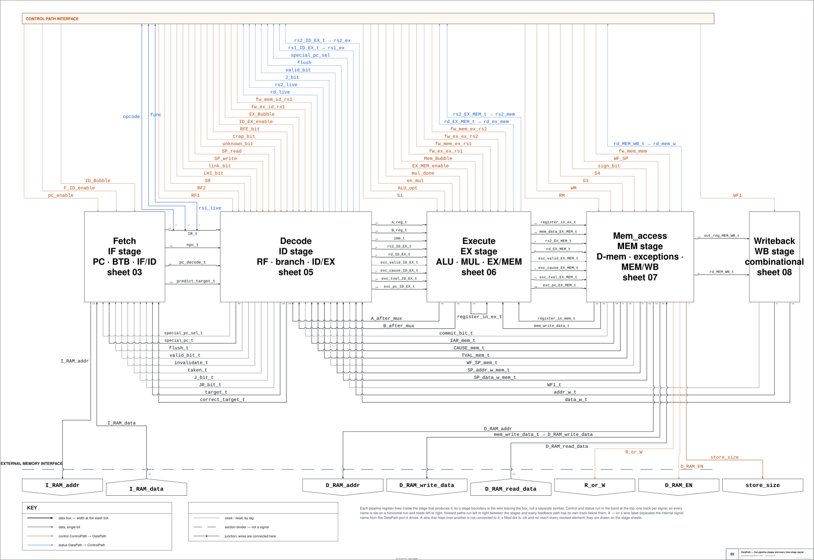
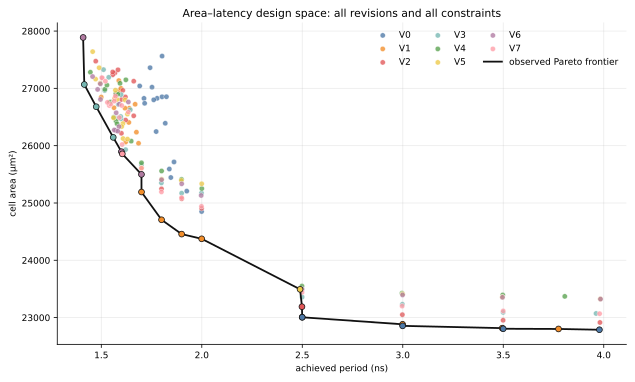

# 5-Stage Pipelined DLX Processor

A 32-bit DLX processor in VHDL, with branch prediction, forwarding, a pipelined
Booth/Dadda multiplier, byte/half-word/word memory operations and exceptions,
and a study of eight RTL revisions (V0–V7) that shorten its clock period. The
repository holds the schematics, 336 Design Compiler runs, workload-annotated
power estimates, RTL and gate-level regression results, and the scripts that
rebuild every table and figure. The RTL itself is withheld because of
university obligations; it can be shared privately where permitted.



The pipeline, forwarding network, branch prediction, memory system and
exceptions are described in [`doc/architecture.md`](doc/architecture.md), with
stage-level sheets in [`schematics/`](schematics/).

## Results

All eight versions run every test program in exactly the same number of
cycles ([`data/cycle_counts.csv`](data/cycle_counts.csv)), so a version's speed
is its achieved clock period alone. Achieved period is
`requested period − worst slack`: the period at which that netlist meets
timing.

### Version overview

Each row describes one netlist: the version's fastest run, with that
netlist's own area, power and energy at its achieved period. The last column
compares every version at a common 500 MHz, using its 2.0 ns netlist. Power
is measured on two programs, the mixed `20_power_bench` (2,819 cycles) and
the multiply-accumulate `24_mac_loops` (4,283 cycles); energy is for one run
of each.

| Version | Fastest achieved period | Area | Power at that period: mixed / MAC | Energy per run: mixed / MAC | Power at 500 MHz: mixed / MAC |
|---|---:|---:|---:|---:|---:|
| V0 | 1.6910 ns | 27,042 µm² | 8.65 / 9.73 mW | **41.3** / **70.7** nJ | **7.24** / 8.11 mW |
| V1 | 1.4997 ns | 26,848 µm² | 9.82 / 11.14 mW | 41.4 / 71.4 nJ | 7.24 / 8.11 mW |
| V2 | 1.4723 ns | 27,474 µm² | 10.25 / 11.57 mW | 42.6 / 73.2 nJ | 7.25 / **8.10** mW |
| V3 | 1.4154 ns | 27,068 µm² | 10.56 / 11.91 mW | 42.1 / 72.3 nJ | 7.41 / 8.30 mW |
| V4 | 1.4456 ns | 27,281 µm² | 10.59 / 12.07 mW | 43.1 / 74.8 nJ | 7.47 / 8.29 mW |
| V5 | 1.4569 ns | 27,641 µm² | 10.75 / 12.11 mW | 44.1 / 75.6 nJ | 7.55 / 8.36 mW |
| V6 | **1.4096 ns** | 27,888 µm² | 10.99 / 12.32 mW | 43.5 / 74.2 nJ | 7.48 / 8.27 mW |
| V7 | 1.5024 ns | 27,187 µm² | 9.86 / 11.04 mW | 41.8 / 71.2 nJ | 7.28 / 8.27 mW |

Power at different periods is not directly comparable, because a faster
netlist switches more often; compare power at 500 MHz, or energy per run.

### Which version for which goal

| Goal | Choice | Evidence |
|---|---|---|
| Highest frequency | V6 | 1.4096 ns (709 MHz); V3 is 5.8 ps behind |
| Best balance of speed, area and energy | V3 | lowest energy × time on both programs (168 / 438 nJ·µs against V6's 173 / 448), with 820 µm² less area than V6 |
| Lowest power at a fixed 500 MHz | V0 / V1 / V2 | within 0.2% of each other; V3–V6 draw 2–4% more |
| Smallest area at or below 1.60 ns | V6 | 25,895 µm² at 1.6000 ns |
| Smallest area at or below 1.70 ns | V1 | 25,191 µm² at 1.7000 ns |

### What each revision did

Measured over 13 identical requested constraints (1.00–1.60 ns): how many got
faster than the previous version, the median change in achieved period, and
the change in power at 500 MHz.

| Revision | Change | Faster / 13, median Δ | 500 MHz power Δ: mixed / MAC |
|---|---|---:|---:|
| V1 | Branch conditions from the register value and forwarded EX flags in parallel; redirect comparison and exception-vector logic restructured | **13, −149.3 ps** | 0.0% / +0.1% |
| V2 | Predicted address compared with three candidate targets in parallel | 9, −21.0 ps | +0.2% / −0.2% |
| V3 | Sign/zero bits stored beside each register, removing zero detection from branch resolution | 9, −23.7 ps | **+2.1% / +2.5%** |
| V4 | BTB update registered; its alignment guards and invalidation removed | 7, −2.0 ps | +0.8% / −0.2% |
| V5 | Special-register index guards moved out of the exception priority logic | 8, −12.5 ps | +1.0% / +0.9% |
| V6 | EX and MEM forwarding requests made independent | 9, −13.3 ps | −0.9% / −1.1% |
| V7 | V3 plus V6's forwarding edit, without V4 and V5 | 2, +16.0 ps | −2.6% / 0.0% |

V1 is the only consistent single-step gain; a 9/13 split occurs by chance
about one time in four. V4–V6 together are faster than V3 at 11/13 points at
nearly the same power, and V7 shows that V6's edit alone does not give that
gain. V3's stored flags are the only change that costs noticeable power. The
reasoning behind every revision is in [`doc/revisions.md`](doc/revisions.md).



Per-constraint ranks, adjacent deltas, power against period and the
comparison of the two synthesis scripts are in
[`analysis/README.md`](analysis/README.md).

## Verification

24 directed assembly programs run on the RTL and their final data memory is
compared word for word with a software reference model. Every synthesized
netlist of every version also runs the suite at gate level, zero-delay at its
achieved period, and passes. [`verification/`](verification/) has the
programs, the archived results, the coverage map and the two known
I-cache-mode mismatches.

## Repository map

- [`doc/`](doc/) — architecture, revision record and methodology.
- [`schematics/`](schematics/) — editable and publication-ready architecture sheets.
- [`analysis/`](analysis/) — the full synthesis comparison and its figures.
- [`verification/`](verification/) — assembly tests and archived RTL results.
- [`evidence/`](evidence/) — synthesis configuration and reports, power tables, gate-level and per-version RTL results.
- [`data/`](data/) — validated run-level and derived tables.
- [`scripts/`](scripts/) — extraction, summary, verification and plotting.

The tables and figures rebuild from the archived evidence:

```text
python -m pip install -r requirements.txt
python scripts/extract_results.py
python scripts/summarize.py
python scripts/check_verification.py
python scripts/plot_results.py
```

Resynthesis and simulation need the withheld RTL and the original EDA tools.
Metric definitions are in [`doc/methodology.md`](doc/methodology.md).

## Next work

- Add event counters to the testbench (stalls, flushes, predictions and
  mispredictions, forwarding selections, multiplier activity) to explain the
  cycle counts already reported.
- Add a dedicated write-back schematic and a V7-specific schematic delta.
- Add place-and-route, extracted parasitics and multi-corner timing, then
  re-run the activity-based power analysis after layout.
