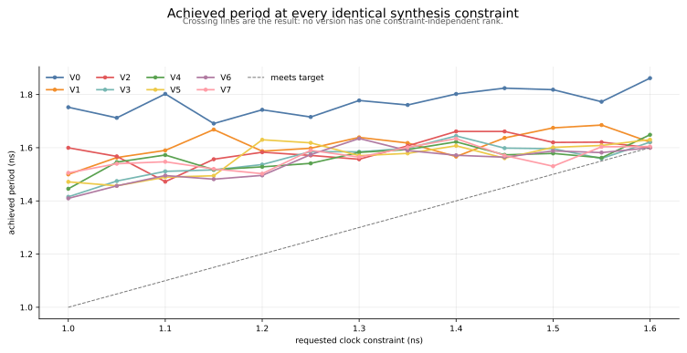
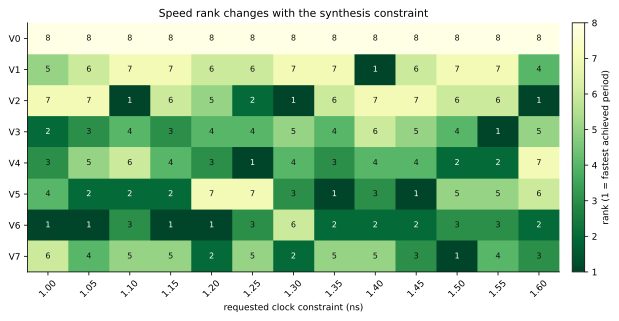
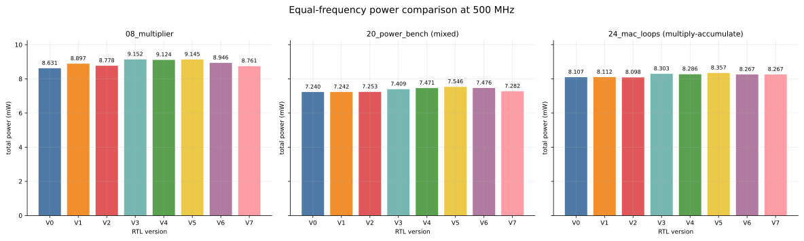
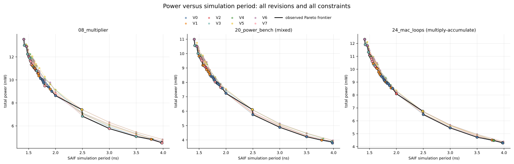
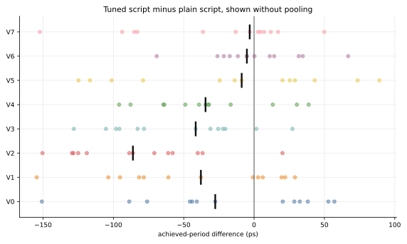

# Full synthesis comparison

This section compares V0 through V7 across the synthesis sweep. Except for
the script-comparison section, version rankings and plots use the tuned script.

## Experiment inventory

| Item | Value |
|---|---|
| RTL snapshots | V0–V7 |
| Synthesis scripts | plain (`old`) and tuned (`new`) |
| Constraints per version/script | 21 |
| Total runs | 336 |
| Tight comparison band | 1.00–1.60 ns in 0.05 ns steps (13 points) |
| Tool | Synopsys Design Compiler W-2024.09-SP2 |
| Library/corner | Nangate OpenCell 45 nm, typical |

Achieved period is reconstructed as requested period minus the worst timing
group slack. Area is parsed from `report_qor`. Each derived row records its
source report in [`../data/synthesis_runs.csv`](../data/synthesis_runs.csv).

## Version overview

The columns summarize the 13-point tight band. Rank ranges and each version's
fastest netlist with its own area, power and energy per run are in
[`../data/version_summary.csv`](../data/version_summary.csv) and the
[main README](../README.md#version-overview).

| Version | Median period | Best period | Median area | Leads / 13 |
|---|---:|---:|---:|---:|
| V0 | 1.7730 ns | 1.6910 ns | 26,826 µm² | 0 |
| V1 | 1.6178 ns | 1.4997 ns | 26,662 µm² | 1 |
| V2 | 1.5997 ns | 1.4723 ns | 26,965 µm² | 3 |
| V3 | 1.5846 ns | 1.4154 ns | 26,680 µm² | 1 |
| V4 | 1.5726 ns | 1.4456 ns | 26,899 µm² | 1 |
| V5 | 1.5787 ns | 1.4569 ns | 26,797 µm² | 2 |
| V6 | 1.5717 ns | **1.4096 ns** | 26,722 µm² | **4** |
| V7 | 1.5648 ns | 1.5024 ns | 26,724 µm² | 1 |

V0 is the only stable rank: it is slowest at every tight constraint. Among the
optimized snapshots, every version reaches first place somewhere, while none
remains first across the band.

## Constraint leaders

| Requested period | Fastest snapshot | Achieved period |
|---:|---:|---:|
| 1.00 ns | V6 | 1.4096 ns |
| 1.05 ns | V6 | 1.4565 ns |
| 1.10 ns | V2 | 1.4723 ns |
| 1.15 ns | V6 | 1.4817 ns |
| 1.20 ns | V6 | 1.4959 ns |
| 1.25 ns | V4 | 1.5412 ns |
| 1.30 ns | V2 | 1.5567 ns |
| 1.35 ns | V5 | 1.5787 ns |
| 1.40 ns | V1 | 1.5668 ns |
| 1.45 ns | V5 | 1.5607 ns |
| 1.50 ns | V7 | 1.5305 ns |
| 1.55 ns | V3 | 1.5594 ns |
| 1.60 ns | V2 | 1.6000 ns |

Tightening or relaxing the requested period changes mapping, sizing and
restructuring decisions, producing the observed non-monotonic curves.

## Pairwise speed consistency

Each cell is the number of tight constraints, out of 13, where the row version
has a lower achieved period than the column version.

| Faster row ↓ / comparison → | V0 | V1 | V2 | V3 | V4 | V5 | V6 | V7 |
|---|---:|---:|---:|---:|---:|---:|---:|---:|
| V0 | — | 0 | 0 | 0 | 0 | 0 | 0 | 0 |
| V1 | 13 | — | 4 | 2 | 2 | 4 | 1 | 2 |
| V2 | 13 | 9 | — | 4 | 3 | 5 | 3 | 4 |
| V3 | 13 | 11 | 9 | — | 6 | 6 | 2 | 7 |
| V4 | 13 | 11 | 10 | 7 | — | 5 | 4 | 6 |
| V5 | 13 | 9 | 8 | 7 | 8 | — | 4 | 7 |
| V6 | 13 | 12 | 9 | 11 | 9 | 9 | — | **11** |
| V7 | 13 | 11 | 9 | 6 | 7 | 6 | 2 | — |

All optimized versions beat V0 at every point. V6 is faster than V7 at 11 of 13
matched constraints, while the ordering among V1–V7 changes across the sweep.

A split of 9/13 or less is consistent with chance; see
[`../doc/methodology.md`](../doc/methodology.md#comparisons).

## Adjacent revision effects

The speed delta is `later − earlier`.

| Step | Faster / slower | Median period delta | Delta range | Median area delta |
|---|---:|---:|---:|---:|
| V0→V1 | 13 / 0 | **−149.3 ps** | −252.6 to −22.6 ps | −173 µm² |
| V1→V2 | 9 / 4 | −21.0 ps | −117.7 to +100.0 ps | +310 µm² |
| V2→V3 | 9 / 4 | −23.7 ps | −184.3 to +38.8 ps | −302 µm² |
| V3→V4 | 7 / 6 | −2.0 ps | −44.3 to +71.2 ps | +148 µm² |
| V4→V5 | 8 / 5 | −12.5 ps | −89.0 to +101.8 ps | +35 µm² |
| V5→V6 | 9 / 4 | −13.3 ps | −134.0 to +64.5 ps | −122 µm² |
| V6→V7 | 2 / 11 | **+16.0 ps** | −69.9 to +95.9 ps | −21 µm² |

Equal-frequency power deltas are in
[`../data/fixed_frequency_power_deltas.csv`](../data/fixed_frequency_power_deltas.csv).

What these steps mean for each revision, including the V3→V7 and V3→V6
comparisons that isolate the later edits, is in
[`../doc/revisions.md`](../doc/revisions.md).

## Area versus achieved period

This global design-space view includes all 21 tuned-script constraints for all
eight revisions. The black line connects the observed Pareto frontier, and its
filled markers retain the version colors.

There is no single area result independent of performance. Using only observed
runs, V6 has the lowest area among points achieving at most 1.60 ns
(25,895 µm²). With a 1.70 ns limit, V1 has the lowest area (25,191 µm²). The
complete matched-speed table is
[`../data/matched_speed_area.csv`](../data/matched_speed_area.csv).

## Equal-frequency power comparison

Every version's 2.0 ns netlist achieves a period of at most 2.0 ns, so all
eight are simulated at 2.0 ns (500 MHz), with 100% annotation coverage. Each
activity window covers one run of the program, from the end of reset to its
final self-loop, and every version runs each program in the same number of
cycles, so energy per run compares the same work. How the activity is
produced is in the [power evidence notes](../evidence/power/methodology/README.md).

| Version | `20_power_bench` (mixed) | `24_mac_loops` (MAC) | Energy per run: mixed / MAC | `08_multiplier` |
|---|---:|---:|---:|---:|
| V0 | **7.240 mW** | 8.107 mW | **40.69** / 69.30 nJ | **8.631 mW** |
| V1 | 7.242 mW | 8.112 mW | 40.70 / 69.34 nJ | 8.897 mW |
| V2 | 7.253 mW | **8.098 mW** | 40.76 / **69.22** nJ | 8.778 mW |
| V3 | 7.409 mW | 8.303 mW | 41.64 / 70.98 nJ | 9.152 mW |
| V4 | 7.471 mW | 8.286 mW | 41.99 / 70.83 nJ | 9.124 mW |
| V5 | 7.546 mW | 8.357 mW | 42.41 / 71.44 nJ | 9.145 mW |
| V6 | 7.476 mW | 8.267 mW | 42.02 / 70.67 nJ | 8.946 mW |
| V7 | 7.282 mW | 8.267 mW | 40.93 / 70.66 nJ | 8.761 mW |

V0–V2 lie within 0.2% of each other. V3's stored register flags add
2.1% / 2.5%, the largest single step; V4–V6 stay within about 1% of V3. On
the mixed program V7 returns most of the way to V0–V2; on the MAC program it
stays with V3–V6. `08_multiplier` reaches its final loop after 79 cycles, so
its 70-cycle window is short and noisier than the other two.

## Power versus simulation period

Power is plotted against `sim_period_ns`, the clock period used to generate the
annotated activity. The black line connects the observed Pareto frontier, and
its filled markers retain the version colors. Exact version and synthesis-
constraint ownership is available in
[`../data/pareto_points.csv`](../data/pareto_points.csv).

## Synthesis-script comparison

| Version | Tuned faster | Plain faster | Median tuned − plain |
|---|---:|---:|---:|
| V0 | 7/13 | 6/13 | −27.6 ps |
| V1 | 8/13 | 5/13 | −37.8 ps |
| V2 | 12/13 | 1/13 | −86.1 ps |
| V3 | 11/13 | 2/13 | −41.5 ps |
| V4 | 10/13 | 3/13 | −34.5 ps |
| V5 | 7/13 | 6/13 | −8.8 ps |
| V6 | 7/13 | 6/13 | −5.1 ps |
| V7 | 7/13 | 6/13 | −3.1 ps |

The tuned script is helpful for V2–V4 and nearly balanced for V0/V5/V6/V7.
The result is version-dependent, so the 104 points are not pooled into one
universal script effect.

## Source tables

- [`../data/synthesis_runs.csv`](../data/synthesis_runs.csv) — all 336 validated runs.
- [`../data/version_summary.csv`](../data/version_summary.csv) — per-version overview.
- [`../data/rank_by_constraint.csv`](../data/rank_by_constraint.csv) — rank heatmap input.
- [`../data/constraint_leaders.csv`](../data/constraint_leaders.csv) — fastest/slowest by constraint.
- [`../data/pairwise_speed_wins.csv`](../data/pairwise_speed_wins.csv) — pairwise counts.
- [`../data/same_constraint_deltas.csv`](../data/same_constraint_deltas.csv) — adjacent changes.
- [`../data/matched_speed_area.csv`](../data/matched_speed_area.csv) — observed area at speed limits.
- [`../data/fixed_frequency_power.csv`](../data/fixed_frequency_power.csv) — 500 MHz power comparison.
- [`../data/fixed_frequency_power_deltas.csv`](../data/fixed_frequency_power_deltas.csv) — adjacent power changes at 500 MHz.
- [`../data/pareto_points.csv`](../data/pareto_points.csv) — all plotted points and frontier membership.
- [`../data/script_comparison.csv`](../data/script_comparison.csv) — per-version script behavior.
- [`../data/cycle_counts.csv`](../data/cycle_counts.csv) — RTL cycles per test, every version.

Metric definitions are in [`../doc/methodology.md`](../doc/methodology.md).
