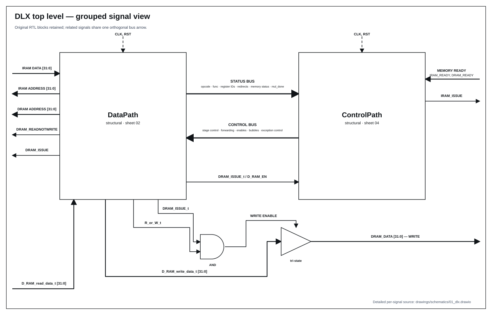
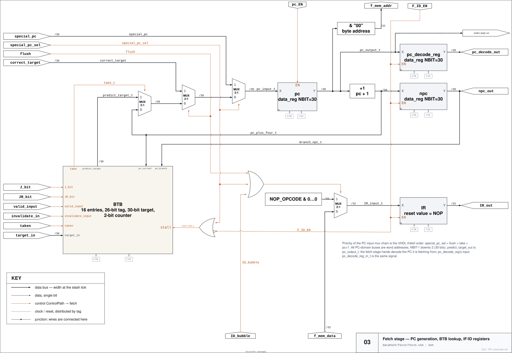
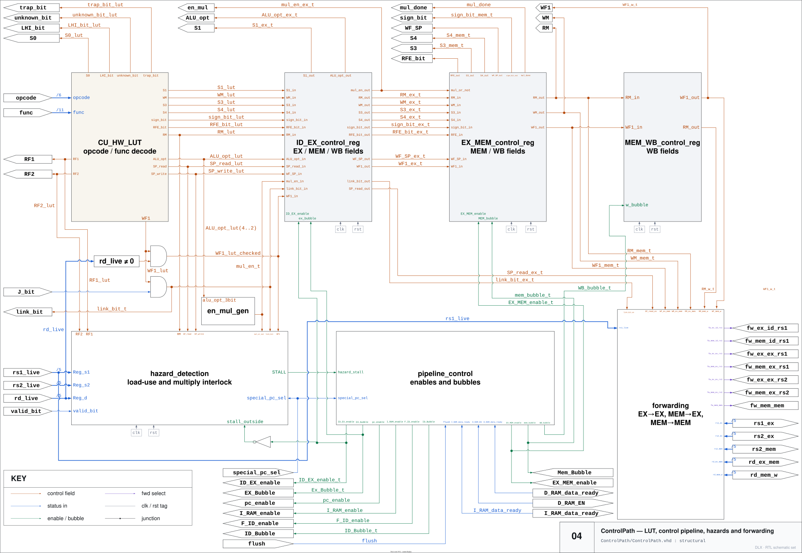
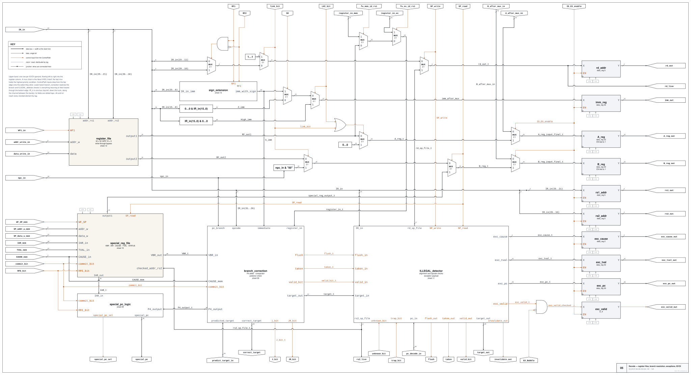
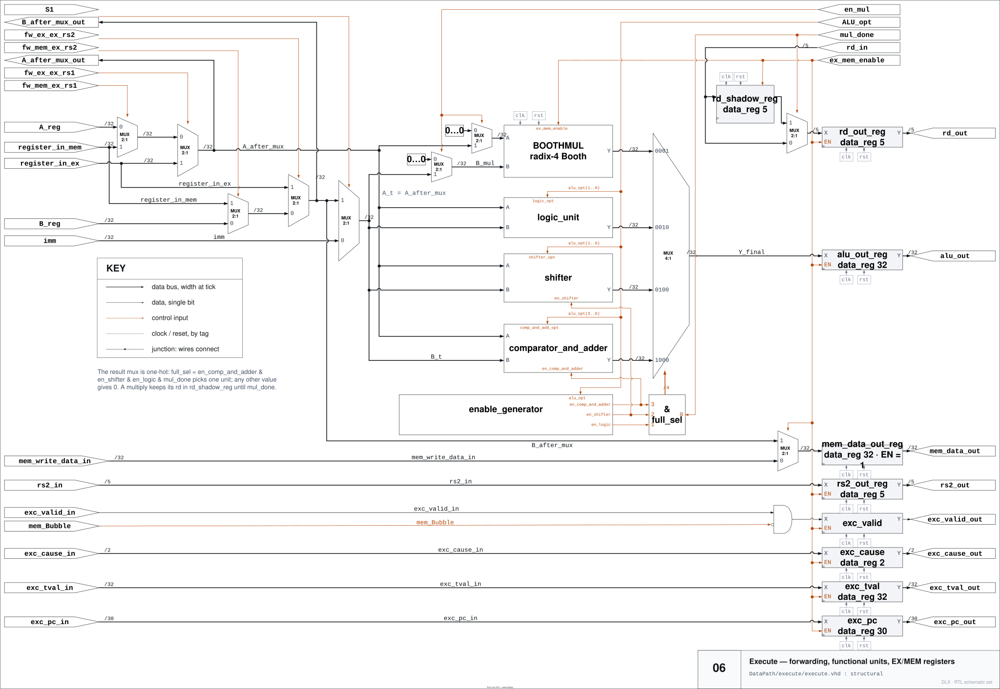
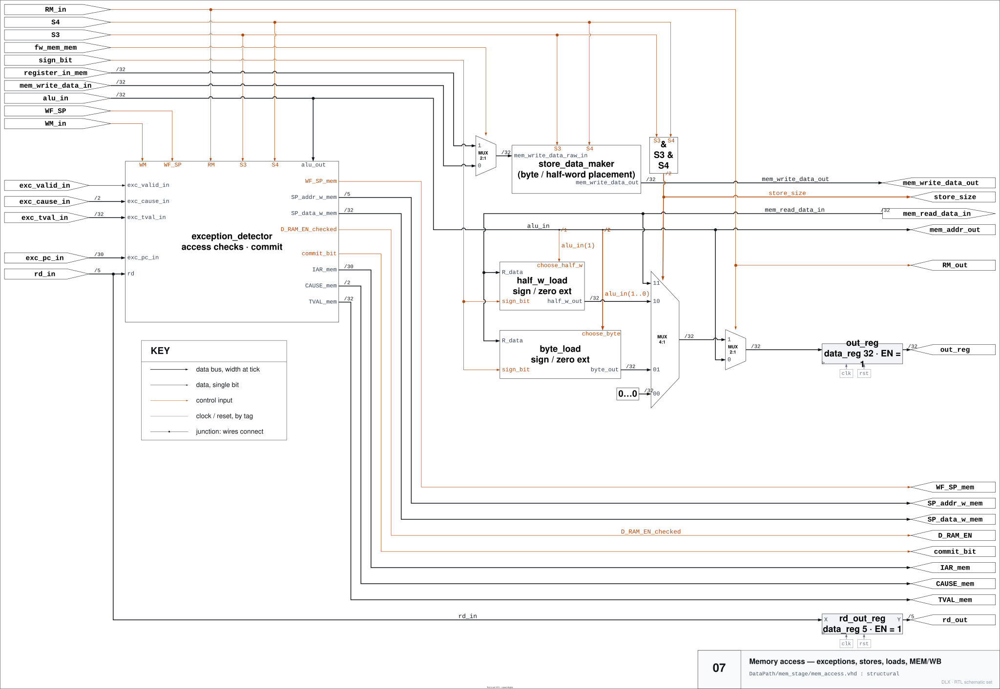

# DLX architecture schematics

The structural sheets document the pipeline organization used throughout
the optimization study.

The drawings principally trace the baseline/common structure; version-specific
changes are described in [`../doc/revisions.md`](../doc/revisions.md).

| Sheet | Scope | Files |
|---|---|---|
| 01 | Top-level DLX and memory interfaces | SVG |
| 02 | Five-stage datapath | SVG, draw.io |
| 03 | Fetch, PC and BTB | SVG, draw.io |
| 04 | Control and forwarding | SVG, draw.io |
| 05 | Decode and branch correction | SVG, draw.io |
| 06 | Execute and multiplier | SVG, draw.io |
| 07 | Memory and exceptions | SVG, draw.io |

Write-back is included in the datapath overview; a separate public sheet is
planned.

## 01 — system overview

## 02 — complete datapath

## 03 — fetch and branch prediction

## 04 — control path

## 05 — decode

## 06 — execute

## 07 — memory access

